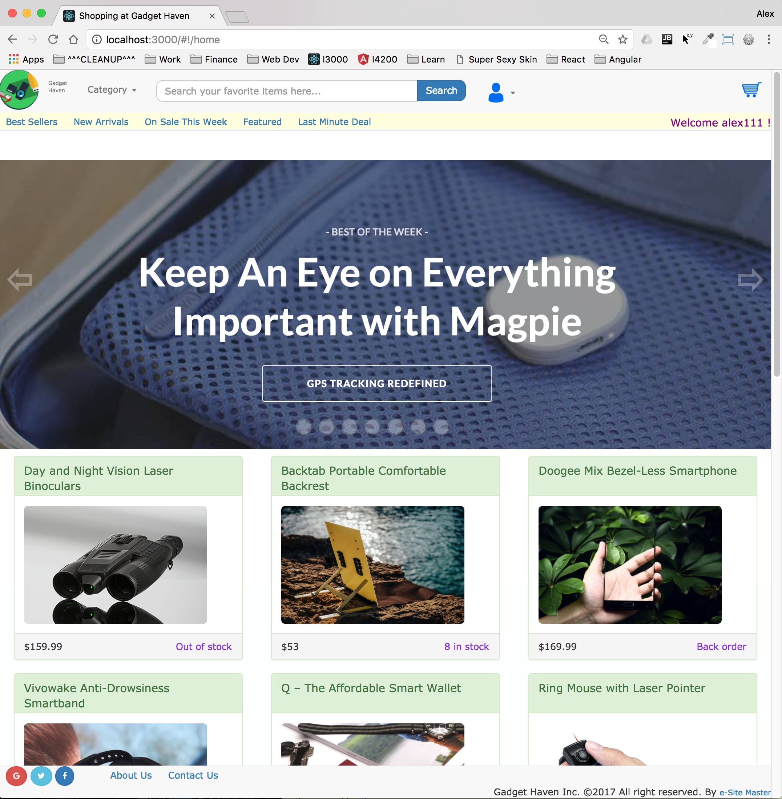
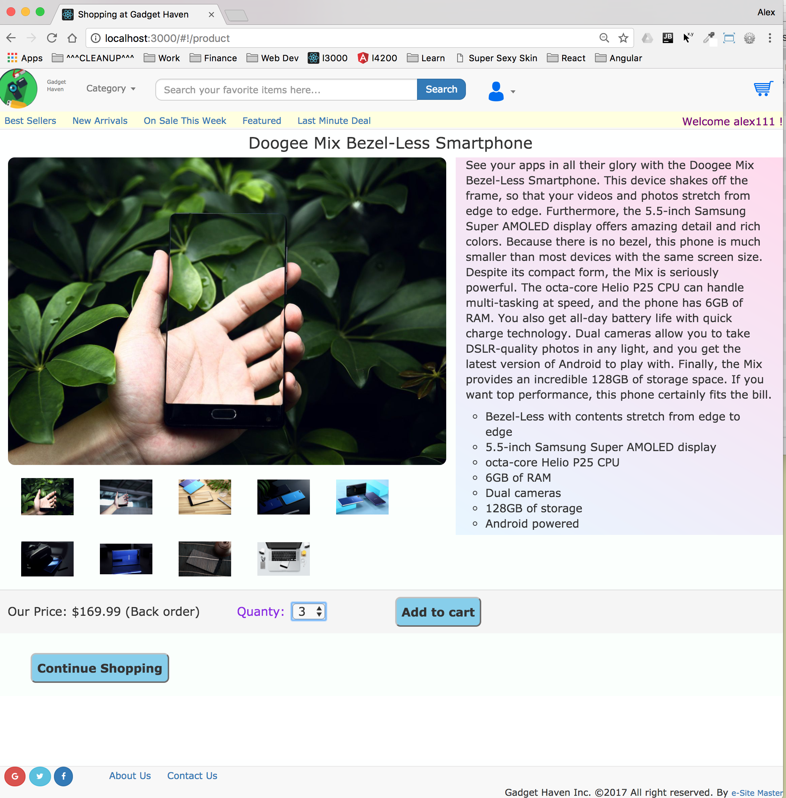
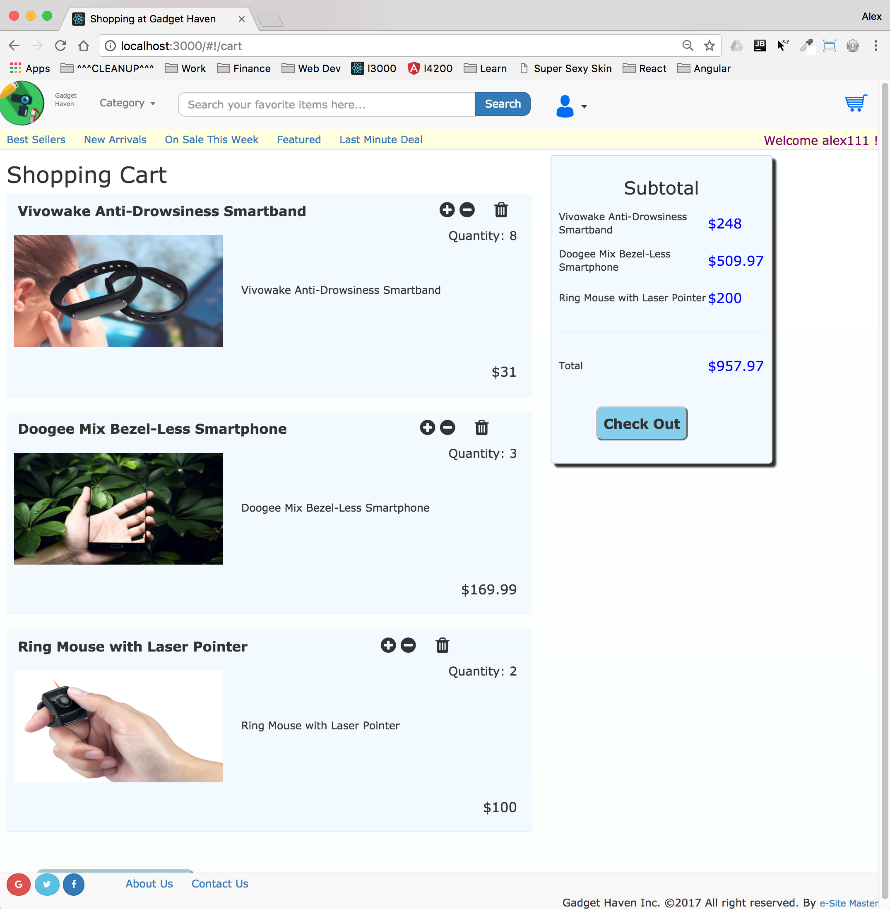
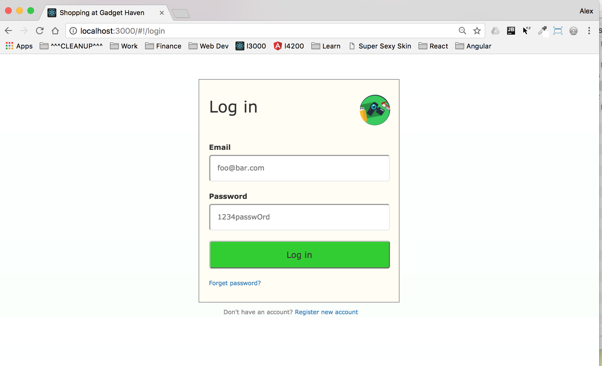
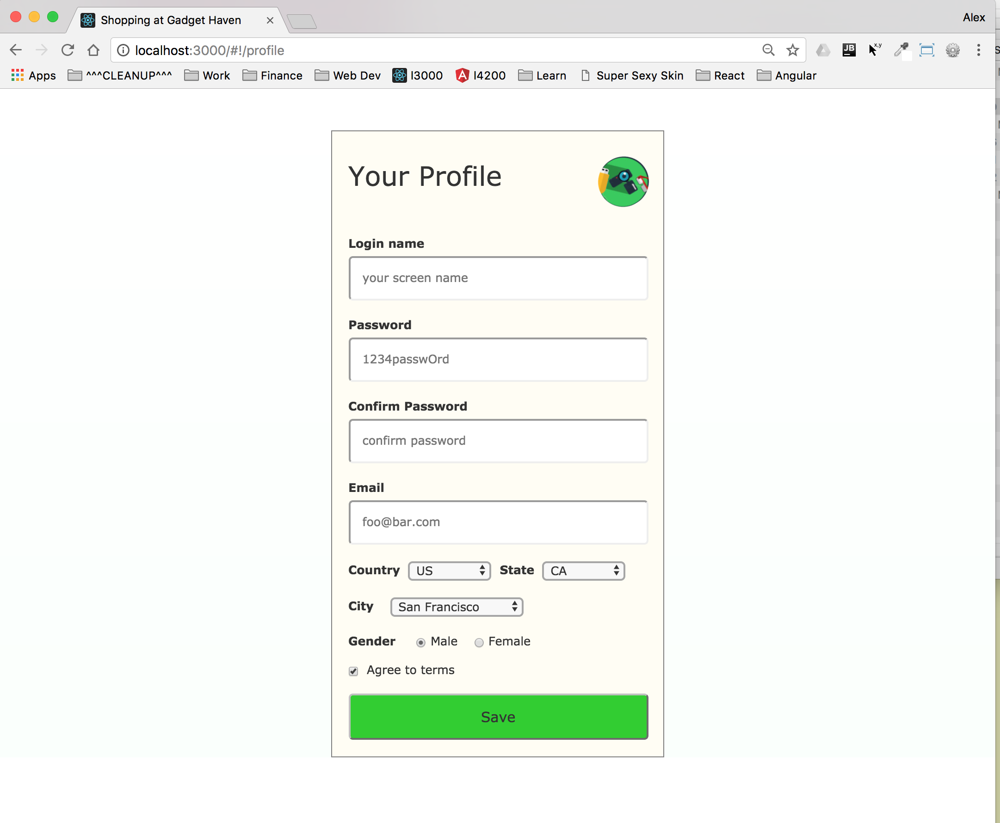
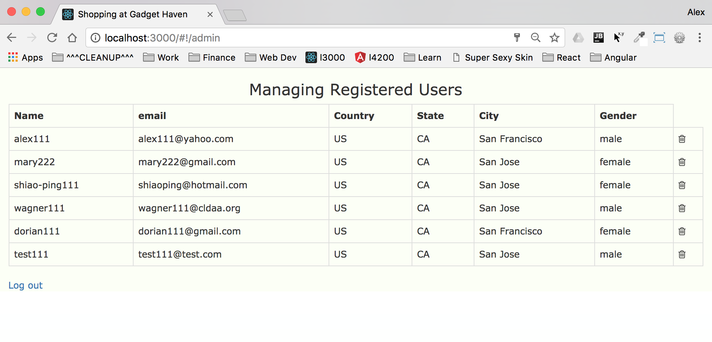

# ShoppingSite

This project features a shopping site with the basic ability for registered users to browse
products on sale and place orders.  This is part of the CodeGarage boot camp project initially developed
under AnuglarJS (1.0) and subsequently converted to Angular 4.0. 

Please refer to this github repository: https://github.com/shorebird2016/A4-Gadget-Haven

Demo: TBD

#### Sample Screen Shots








#### Features
- Fixed header with logo (animation), search bar, shopping cart icon, profile icon
- User login/logout, editing profile, new user registration
- Category dropdown to assist user search
- User may type in search criteria and auto-complete
- Randomly selected product photo in carousel, auto-sliding plus click navigation
- Product thumbnail gallery, maybe filtered based on categories
- Click navigation to full product page from home page
- Shopping cart management with full CRUD ability
- ....

#### Folder Structure

The source tree looks like this:
```
  doc/
  e2e/
  karma.conf.js
  node_modules/
  package.json
  protractor.conf.js
  README.md
  src/
    app/
      app.component.css
      app.component.html
      app.component.spec.ts
      app.component.ts
      app.module.ts
      cart/
      checkout/
      common/
      home/
      intf/
      product/
      profile/
      reference/
      svc
    assets/
      header/
      logo.png
      product/
      product/data/product.json
      product/data/order.json
      product/data/user.json
    environments
    favicon.ico
    index.html
    main.ts
    polyfills.ts
    styles.css
    test.ts
    tsconfig.app.json
    tsconfig.spec.json
    typings.d.ts    
  tsconfig.json
  tslint.json      
```

## Dev Log
#[2017-09-17] 3.5h
 - Start new standalone project, goal is to port from A1 project from CodeGarage class {0.5h}
 - Build a temporary navigation to debug separate routes, tear down later
 - <NOTE>After adding new libraries(such as bootstrap), must stop server, restart
 - Attempt to port over header, but in A1 it uses ng-include which is no longer supported, need to turn it
   into A4 directive first {0.5h}
 - Header component needs product data, learned that shared data can be provided via Service.  But there might
   be considerations for asynchrony so rxjs will come in handy, still just reading. {0.5h}
 - Plan to create a ProductService that can provide categories, product listings by some criteria (all, category
   price range, avaiability..etc) and all components can DI it and listen to changes. Also change product.js into
   products.json (JSON standard is strict, doesn't allow trailing comma and hard to handle long string, also
   every key needs to be double quoted) {1h}
 - If HttpModule is not declared in app.module.ts, error "No provider for Http" will show when refresh
 - Sucessfully read products.json into HomeComponent {0.5h}
 - For some reasons, AppComponent doesn't have life cycle callbacks {0.5h}
 - search type='search', new to me, a valid type, underneath when submit q=searchtrem will be sent to server;
   that's the only difference from type='text'.  MUST set 'name' otherwise nothing is sent.

#[2017-09-18] 4h
 - Start implementing product page, plan to upload git a few times each week {1h}
 - Remove previous thumbnail folder and full-image folders, combine into one {1h}
 - Add my own carousel onto the top middle, convert into A4 code, turns out ng-style is direct conversion {1.5h}
 - Tricky to set timer/interval because context change, use bind(this) on callbacks, also problem with multiple
   un-cancelled timers making sliding strange, this BUG seems to be created when clicking arrows,circles too fast{0.5h}
 - Make circles center horizontally and light up one at a time {0.5h}

#[2017-09-19] 2h
 - Port over footer, change google plus, facebook, twitter icons
 - Category filter using input/output between home and header component {1.5h}
 - Engage search by string, pop up search list {0.5h}

#[2019-09-20] 4.5h
 - Port over login page, reset password page, account page, no functions yet {1h}
 - Spent a lot of time trying to find new local storage wrapper in A4, angular-async-local-storage looks good,
   but no information about how to initialize it to LocalStorageDatabase. {1.5h}
 - Try ngx-warehouse, also the same problem, so it might be A4 problem, no more time today {1h}
 - Both have the same error " Error: No provider for StorageService!" as soon as service class is injected
 - It turns out UserService can NOT inject another service StorageService unlike usual component has a decorator
 - So directly inject storage service into components and that seems fine, redesign logic, maybe tomorrow
 - Lastly I was able to figure out DOM manipulation via element ref directly injected at CTOR() or use #ref in
   HTML plus @ViewChild('ref') ts-name to access this element, then use Renderer2 to setStyle()
 - At a component's CTOR, inject ElementRef essentially provides DOM reference to self
      constructor(private elem: ElementRef...{1h}

#[2017-09-21]
 - Port Admin page, just the view, no data yet {0.1h}

#[2017-09-22] 7.5h
 In flight to Taiwan
 - Login page, why admin@admin.com always show up? After half an hour, give up, possibly chrome
   is remembering it {0.5h}
 - Work on getting account form to validate, country/state/city variations via select, radio button,
   checkbox..etc w/o online information
     Figured out one way to do for select tag - use (change) {{}} [ngValue], ngModel doesn't work
    {3h}
 - Start local storage work, perfect for in the air, first register user, then read back, then
   show them all in admin view, then authenticate, then delete {3h}  
 - Loose ends with user account: at startup time, if user was logged in last time, 
   show logged in menus, logout action, close button {1h}

#[2017-09-26] 3h
 - Some basic testing, found many problems.{1h}
 - By accident, replace <form> with <div> not only remove the need for "name" attribute, also magically
   makes "ngModel" work as planned. Also [ngModel] works too.  Without "name" attr and "<form>", login name
   password, password confirm all showed up. The only remaining ones are combo and radio. {0.5h}
 - Update user profile button should see all, checkbox is also toggling via ngModel {0.5h}
 - Checkbox / radio buttons can toggle back and forth via [(ngModel)] and mutually exculsive {0.5h}
   turns out the mutual exclusiveness is built into the ngModel the two share same ngModel. Yeah
 - With clear mind, was able to make country/state/city combos working exactily right using ngModel
   plus a helper when dropdown is changed.{0.5h}
 Temporarily move on to big feature - product page, deal with accounts later

#[2017-09-28] 3.5h
 - Due to yesterday's success on making product service available as an Observable (in rxjx project),
   now I can make ProductService in this project into one and many component can listen to data w/o
   polling, the tasks (1)Add subject to product service (2)whenever data is read from external source,
   send to listeners(next() method) (3)provide a method for clients to subscribe.  Presently, HomeComponent,
   ProductComponent and HeaderComponent all need product information. All working now. {1h}
 - Similarly for StorageService clients - HeaderComponent, LoginComponent and AccountComponent, 
   they all subscribe to this service, when one changes the data, other will know immediately  
 - Interestingly, user observables don't seem to work as products, this is possibly due to the sequence
   of subscription: products JSON takes long time to load, subscription happens sooner; but users info
   are loaded much faster from LS and hence done before subscription is made. So the next() calls are 
   basically thrown out.  Try BehaviorSubject which will return the last value on subscription. It seems
   to work much better when subscription comes later. {1h}
 - One interesting observation - saw both ProductService and StorageService gets constructed twice, this is
   because they are declared for each component as "providers: [ProductService]", remove them and place only
   one copy in app.module.ts will ensure singleton nature of services. {0.5h} 
 - We can ONLY unsubscribe() a subscription, not Observable
 - Gradually working thru Home, Header, Account, Login components and all seem to work well with both product/storage
   services. {1h}

#[2017-09-29] 4h
 - FIX: if logged in, login name should not be editable in account page
 - FIX: update user in account page was adding the same user with updated info the 2nd time
 - FIX: update city of a user persists ok in LS, but header/account page still show old city for logged in user
   (need to also set logged in user when update profile) {0.5h}
 - show product page based on passed in ID from carousel, thumbnails and search bar dropdown 
   and show feature, quantity, status, order button, styling {1.5h}
 - new service for shopping cart data (service seems to be data models), try w/o BehaviorSubject, it will still
   obtain selected items from LS initially, CRUD should be like singleton.
 - add item to cart from product page, cart items are persisted in LS, inc/dec/remove all seem to work {2h}  
 - Tonight I also prove that service can share data, as long as components don't buffer data, go directly to 
   service class.  So BehaviorSubject is only needed if data keeps on changing outside user control.

#[2017-09-30] 1h
 - End of quarter, one more quarter for 2017, good time to take a break from this project since other priorities
   such as job hunting starts to creep in.  There is an endless list of things that need to be done for any project.
   The only thing I can do is to keep the ideas below and may continue one day.  It's important to keep learning A4.
   A better place would be the showcase.  So I will switch to showcase and learn a bit each day.
   The last 12 days has been great experience porting A1 into A4. Some stats here: (find . -print | xargs  wc -l)
   (1) 91 Source files under app
   (2) 3074 lines under app
   (3) 386 resource files under assets
 - Attempt to reproduce the run time system without node_modules since that took up major space
   The TRICK - use finder to copy all (non hidden files) except node_modules over to new folder, then copy one
               hidden file .angular-cli.json, ng serve will work.  Otherwise this will fail with 
               "Cannot read property 'config' of null" 

[2017-10-05]
  - Bug: product page - quantity should not become minus when decrement
  
#[2017-10-14] 1h
  - a new idea after learning more about Firebase, it turns out to be a fast way to have a backend w/o coding
    so spending a few hours learning/playing.  Create a shopping DB with product sub-tree, order tree and 
    user tree as start.  Also learned if need to make a tree node non-leaf object, click + then + again to show 2 levels
    so the first level is a parent node.  Learned using TAB to add more rows at same level {1h}  
    
#[2017-10-15] 2 + 1
  - Firebase looks very appealing for this app in terms of simple but scalable backend w/o a server.
  - Start defining the data nodes in Firebase - product is fine, order and user are new, generate some sample JSON
    files in assets folder. 
  - The best way - model it under WebStorm(since it has syntax check), 
    import under specific node in Firebase, make sure export back after validating it.
  - The goal is really very simple at this point - C R U D persistence in place of LS and JSON, after this goal is
    accomplished, "Data Design" is next. For the near term, since there are so many advanced topics to learn, it
    is appropriate to stick with getting first goal to work but not data design just yet.
  - Experimentation - put errors inside JSON(dup key but syntax ok) and attempt to import, Firebase doesn't restrict
  - Learn - put FirebaseModule inside app.module with initializeApp referring to environment.ts (A4 specific)
  - Learn - from Mosh's video, he uses .subscribe() on db.list which can only be found in angularfire2/database-deprecated
     the non-deprecated version removed subscription from this API
  - C R U D - maintain integrity of product-id, user-id, order-id Uniqueness and Existence, Dup IDs
  - Add new service UserService, test out user node in Firebase (R of CRUD), works
  - Mosh noted the need to avoid "Memory Leak" when going back and forth between pages with subscriptions, 
    but wants me to pay for it.
  
#[2017-10-18] Firebase users conversion
  - Identify all areas with LS service for users, replace with Firebase service
  - Add new node "login-user" at top level node under 'user' node
  - Convert components involved with user data (C R U D) into Firebase code, mainly via AngularFire2 layer {2.5h}
  - Fix some bugs in update account and deletion, change gender to be M and F, export JSON as backup {1h}
  - Remove all LS code and storage service, save a copy of LS based code onto Maverick {0.5h}
  - Firebase hosting seems to be very exciting and free, give it a try. Go to firebase console, click hosting
    on the left nav, click docs to follow CLI steps. Upload speed is very slow, will take a while.  My dist folder
    is 77MB+ w lots of photos. It actually worked after 10 min upload, very simple. Even DB works.
  - Also curious about running ng t on this project. 13 out 18 fail right out of the box. After half an hour, can't
    eliminate errors, stop here till next Tuesday, more learning needed. {0.5h}
  
#[2017-10-20] Firebase product conversion 0.5h
  - Convert file based product data into Firebase served, this is used in product service. {0.5h}
  - Get ready for tomorrow's project work ==> persist orders to DB instead of LS
  
#[2017-10-21] Project dev {1.5}
  - Struggle with whether using a service to work with Firebase, after looking at YT samples, it seems
    AngularFire by itself is a service already, its API is high level enough for components, it encapsulate
    database access, auth so there is no need to know the details at component level.  Therefore the choice
    is to subscribe directly to AngularFire service inside components.  The realtime nature of Firebase and
    AngularFire's reactive nature makes the CRUD easy to do.  I'll start doing this with order node today. {0.5h}
  - Schema for order is organized based on user ID since each user can only have 1 order at any given time
    When order is fullfilled, it will be moved to archived node.
      User ID
        order ID
        item Array 
          product ID
          quantity
  - Not sure at this point how to manage integrity yet, a different challenge for NOSQL DBs
  - Product page: when user is not logged in, don't provide add to cart button
  
#[2017-10-22] Proj dev {4.5h}
  - Thought about idea to create my own re-usable component sbc-navbar at some point, then remember
    material design is already Angular compatible, should just use to begin with. So the next small app
    will start using MDB-xxx massively instead of Bootstrap.  Maybe later on Bootstrap will come with
    components, then I can get back.  Right now v3.37 still needs quite a bit of work in HTML for styling.
  - Continue with shopping app's order persistence into Firebase.
  - Small app ideas from YT -- property listing, zwitter, starwar, startrek collection
  - Still slightly doubtful about "No Service", need a small app to experiment ? can service data automatically
    show up in components w/o subscription?
  - Use cases [UC] for order management
      1. ProductComp - R to obtain order record for login user
                       U to increment item quantity if item is already in order
                       C to add new item to order with quantity 1
      2. HeaderComp - R to obtain order record for cart icon to show number of items
      3. CartComp - R to obtain order record for login user
                    U to increment/decrement item quantity if item is already in order
                    D to add new item to order with quantity 1
  - Learned for..in is only meant for object properties, ES6 for..of is a nice obj iteration tool
  - Created OrderService to manage order related operations, encapsulate FB, mimic LsCartService
  - Ran into obstacle when trying to update item quantity in order, pause and go to basics
  - Found a basic app on github, adapt to A4 call it "ng-fire" project, this can serve as a reference for
    AngularFire apps.  So far, the complex part is in the query portion.
  - Major change: I was importing from angularfirebase/database-deprecated and the samples are all in
    angularfirebase/database, after changing to it, many components won't compile.
  - Took an hour to get login user to work w non-deprecated db, products/users seem to work too, 
    In fact, .valueChanges() is the key to all. It returns Observable for clients to subscribe (which is
    different from deprecated version)
  - Unable to figure out the "key" for updating records, push() is easy and random ID generated, but
    delete/update need keys, not sure how to get them.
    
  
  
  
==========================================N E X T=====S T E P S==========================================
### End to end testing
 --- Attempt to deplay to heroku, watch video first
 --- To verify everything still works
 
### Product Page
 --- custom pipe for product status
 --- very 1st time search on home page and nav to this page, active image doesn't appear cuz it's undefined???
 --- add video player/thumbnails

### Home/Login/Account Page bugs / enhancements
 --- form validation (eg. password match..etc), required, field validation...etc
 --- convert into MDF with validator, current implementation is quasi-TDF, non-standard
 --- more user information like address, SSN, phone..etc
 --- why the default login user/password always admin@admin.com / admin, hard coded somewhere???    
 
### Cart Page
 --- better layout using bootstrap columns to be responsive
 --- add button to go back to home page
  
### Header
 --- cart icon shows item count when user add items to it
 
### Backend
 --- Add FB's authentication
 --- nodejs RESTful server provides persistence of users, products, cart items, maybe user auth
     alternative use Firebase for fast dev plus scalability
 ---  checkout/thank you pages
 ---  architecture diagram...
 ---  use RESTful geo service to get country/state/city list
????? How to query by order ID and/or login directly using AF  
????? How to add type to order, user, product objects and compatible w DB
